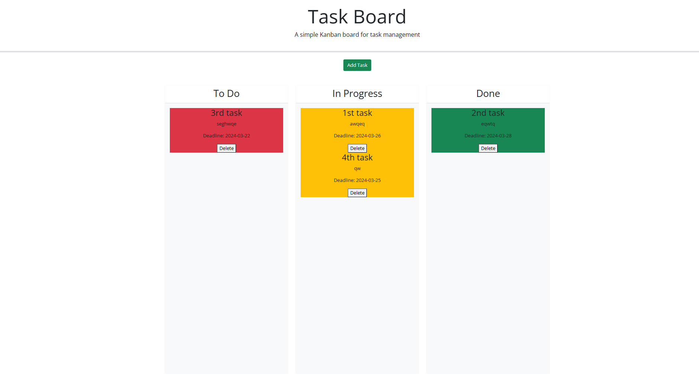
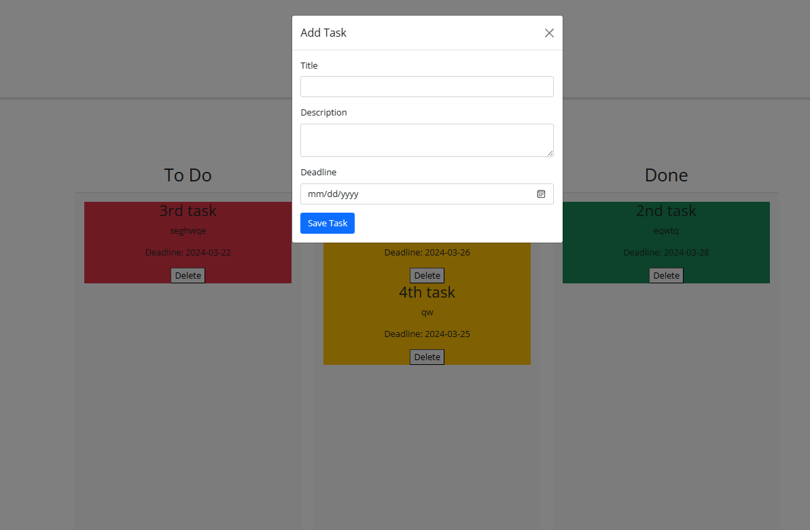

# Task Board

This is a task board that allows you to create a task with a title, description and a deadline date. the tasks change color from green, to yellow, to red depending on if it's close or past the deadline. The task board also allows you to drag and drop task into separate colomns depending on if they have not been started, in progress, or done. 

## Link
https://scoops113.github.io/task-board/

## Screenshot

## License

This project is licensed under the terms of the [MIT License](./LICENSE).